# 抜きゲーみたいな島に住んでる貧乳はどうすりゃいいですか？２

本文简要说明《拔作岛2》汉化程序的实现方法。

## 一、引擎

此游戏使用`椎名里緒(ShiinaRio) `引擎制作，引擎版本号为`v2.50`。

这个引擎有一些防止IDA反编译和和防止动态调试的小手段，需要额外处理一下。

## 二、封包

为了拿到游戏资源文件，我们首先分析它的资源包文件，文件名扩展名为`WAR`，文件头有明显的`WARC 1.7`标识，所以我们直接在IDA中搜索文件头的字符串。

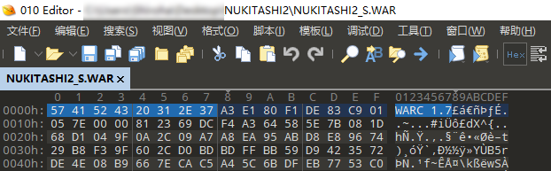

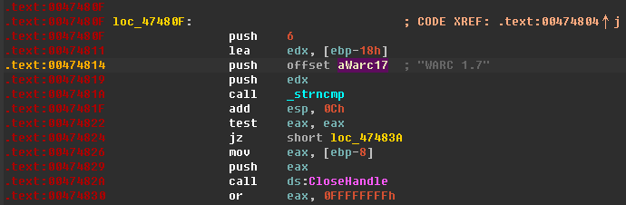

往前找到这个函数的头部`004746D0`，按`P`让IDA分析这个函数。

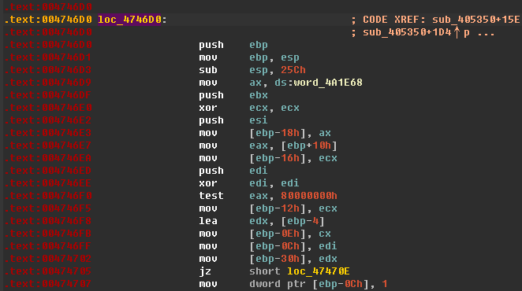

然后发现IDA报错，无法分析。

```
.text:0047471F: The function has undefined instruction/data at the specified address.
Your request has been put in the autoanalysis queue.
```

我们转到`0047471F`这个地址去看看那里有什么。

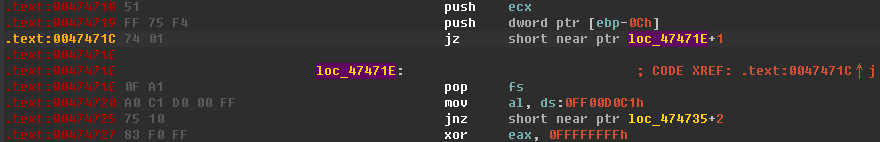

可以看到这里有一个很奇怪的JMP。它从`0047471C`跳到`0047471F`，但是IDA没有正确分析到这个从`0047471F`开始的指令，而是分析成了从`0047471E`开始。很显然这是个防止IDA反编译的技巧，所以我们直接NOP掉这个没有用的JMP就行了。

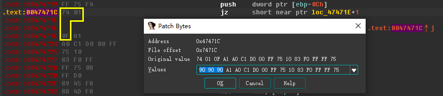

修改后如下图，IDA并没有重新分析`0047471F`处的代码，所以需要在此处按`C`让IDA分析。

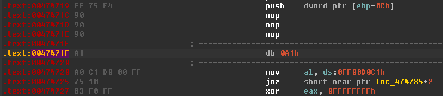

`00474724`处还有一个`FF`没有分析，同样按`C`让IDA分析。

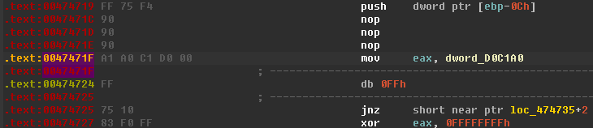

最终结果如下图。

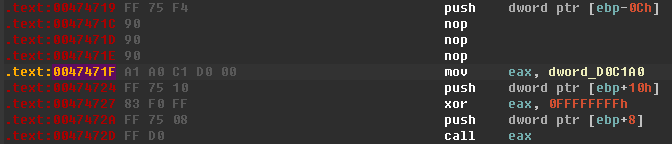

回到函数的头部`004746D0`，继续按`P`让IDA分析函数，然后IDA又报错。

```
.text:004747BF: The function has undefined instruction/data at the specified address.
Your request has been put in the autoanalysis queue.
```

但是`004747BF`附近的代码看起来好像没什么问题，那么问题就可能出在别的地方了。

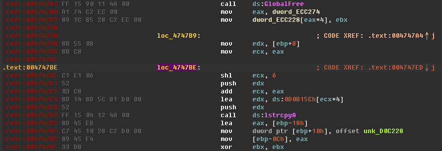

IDA提示`004747BF`处的代码无效，但是我们可以从上图中看到`004747BE`被识别成了一个标签，而不是`004747BF`，说明有其它代码JMP到这里来执行了，所以我们选中`loc_4747BE`然后按`X`看看是哪里JMP过来的。

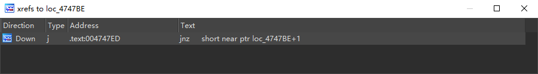

转到`004747ED`，然后立刻注意到上面有跟刚才修改过的一模一样的JMP代码，这说明`004747ED`处的代码是错误的，按照同样的方式修改即可。

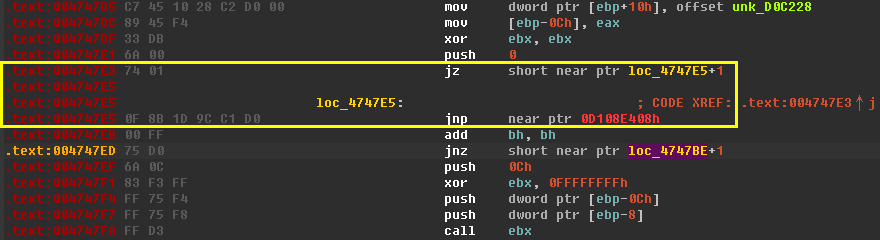

这个函数里类似这样的代码还有好几处，就不重复叙述了。处理完之后，按`P`即可成功创建函数，然后按`F5`即可反编译这个函数。

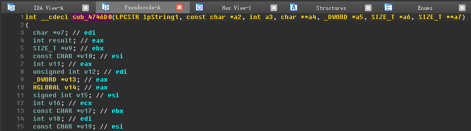

IDA已经帮我们分析出了这个函数的一些参数，我们可以动态调试，看看这些参数是什么。

由于这个游戏在中文系统下运行是需要转区的，所以我们使用`Locale Emulator`来启动游戏。

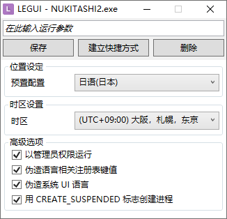

由于我们要挂上调试器，所以把`CREATE_SUSPENDED`勾上，不能让程序立刻跑起来。

我们使用`x32dbg`进行动态调试。由于这个游戏自带调试器检测，所以需要安装`ScyllaHide`插件来隐藏调试器。

随便加载一个预设设置即可，这里我选了`Themida`。

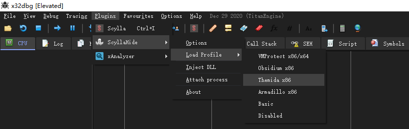

使用`Locale Emulator`启动游戏后，使用`x32dbg`附加到游戏进程，然后恢复主线程运行，使游戏运行起来。

恢复线程后，需要按一下`F9`。

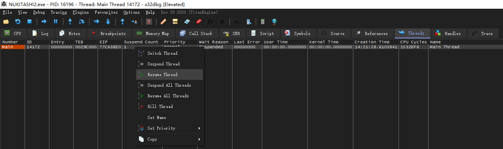

然后在`CPU`窗口中按`Ctrl+G`输入`004746D0`即可转到`sub_4746D0`函数的头部。

在函数头部设置一个断点，必须使用`硬件执行`断点，因为这个游戏引擎自带代码段校验，使用`F2`断点将触发校验失败，导致游戏退出。

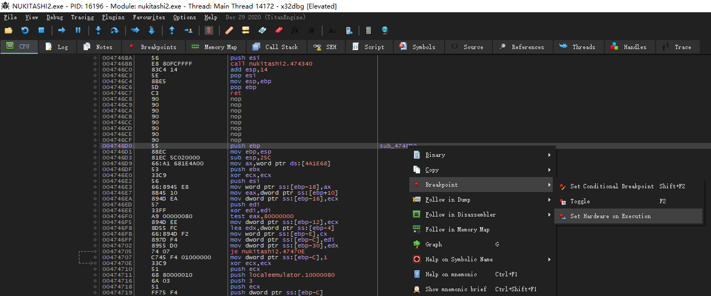

然后切换回游戏窗口，随便动一下，让引擎加载资源文件，就可以在断点处中断下来。

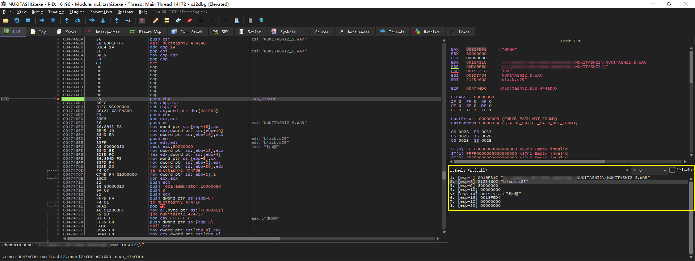

在右边的参数框中可以看到两个文件名，第一个参数是封包文件名，第二个参数是封包内的资源文件名。

知道这两个参数是什么之后，就可以想办法把资源文件Dump出来了。

## 三、文本

在`WAR_Open`下断点，然后开始游戏，引擎会加载剧本文件，中断下来之后，可以看到它是一个`txt`文件。

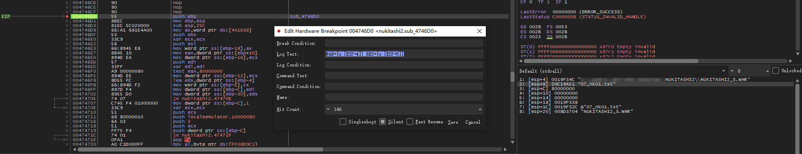

使用`Ctrl+F9`跟踪函数调用关系。

```c
sub_405940
	sub_405560
    	sub_474C30
    		WAR_Open
```

最上面`sub_405940`则是在一个巨大的switch里调用的（位于`sub_4297D0`函数），可以猜测是VM的代码。

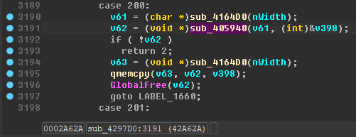

在这个case的代码处下断点跟踪之后发现，`v61`就是资源文件名，也就是剧本文件`xxxxxx.txt`，并且`sub_405940`返回一个缓冲区指针，该缓冲区里就是资源文件的数据，并且`v398`是资源文件的大小。

我们可以Hook`sub_405940`这个函数，或者从这个case里JMP出来，拿到资源文件数据，转存到硬盘上。

```assembly
.text:0042A622 8B CD                                   mov     ecx, ebp
.text:0042A624 E8 A7 BE FE FF                          call    sub_4164D0
.text:0042A629 50                                      push    eax             ; Str
.text:0042A62A E8 11 B3 FD FF                          call    sub_405940      ; 从这里跳出
.text:0042A62F 8B D8                                   mov     ebx, eax
.text:0042A631                         ; 3191:             if ( !v62 )
.text:0042A631 83 C4 08                                add     esp, 8
.text:0042A634 85 DB                                   test    ebx, ebx
```

Hook代码，使用Detours实现。

```c++
LPVOID RIO_LoadResource(LPCSTR lpFileName, LPDWORD lpFileSize)
{
    typedef LPVOID(*PROC)(LPCSTR, LPDWORD);
    auto pfn = (PROC)0x00405940;
    
    auto ptr = pfn(lpFileName, lpFileSize);
    
    // 拿到资源文件数据...
    
    return ptr;
}

static PVOID pLoadResourceNextAddr;

_declspec(naked) void LoadResourceDetour()
{
    _asm
    {
        CALL    RIO_LoadResource
        JMP     pLoadResourceNextAddr // 跳回原函数
    }
}

void InstallResourceHooks()
{
    PVOID pLoadResourceAddr = (PVOID)(0x0042A62A);
    PDETOUR_TRAMPOLINE pLoadResourceTrampoline;

    DetourUpdateThread(GetCurrentThread());
    DetourTransactionBegin();
    DetourAttachEx(&pLoadResourceAddr, LoadResourceDetour, &pLoadResourceTrampoline, NULL, NULL);
    DetourTransactionCommit();

    pLoadResourceNextAddr = pLoadResourceTrampoline->pbRemain;
}
```

实际测试时发现，这个case似乎只加载剧本文件，但是`sub_405940`有很多地方都会调用它，直接Hook它可以拿到几乎所有资源文件的数据。

> 并且还可以替换资源文件数据。

剧本文件拿到之后，就可以开始翻译工作了，然而程序还要继续改。

## 四、转区

这个游戏直接在中文系统下运行会报错，要解决这个问题才行。

直接运行游戏会弹出一个消息框，一堆乱码，原文是`shift-jis`编码，所以我们Hook消息框，把文本转为`unicode`。

```c++
int WINAPI MineMessageBoxA(HWND hWnd, LPCSTR lpText, LPCSTR lpCaption, UINT uType)
{
    auto strText = lpText ? ShiftJisToUcs2(lpText) : CStringW();
    auto strCaption = lpCaption ? ShiftJisToUcs2(lpCaption) : CStringW();

    return MessageBoxW(hWnd, strText, strCaption, uType);
}

void InstallHooks()
{
    IATHook(NULL, "USER32.DLL", "MessageBoxA", MineMessageBoxA);
}
```

现在可以正常显示日文了。

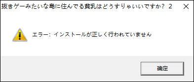

意思就是游戏没有正确安装。

一般来说游戏会从注册表查找游戏按照路径，如果找不到就会提示这种错误。

我们可以在调试器中给注册表读写的API下断点，或者用`ProcessMon`之类的工具监控游戏进程，就知道它想读取注册表什么位置了。

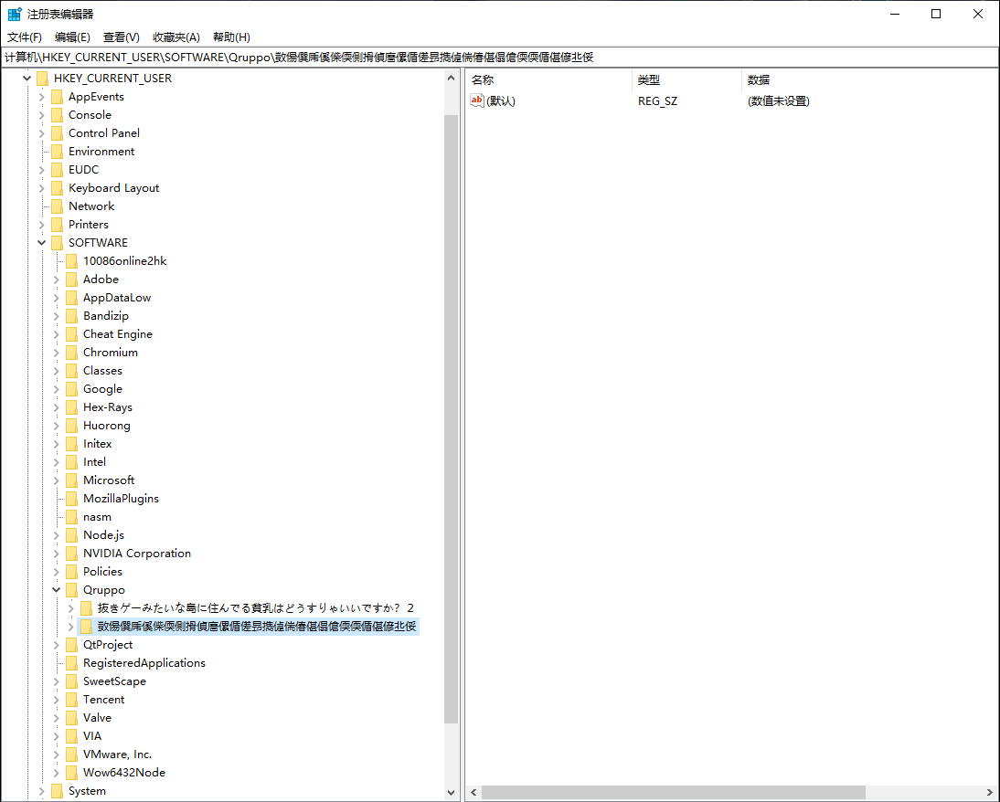

注册表里有一个乱码的项，所以游戏肯定是在调用注册表读写API的时候传入了`shift-jis`编码的字符串。

可以像上面`MessageBoxA`一样，Hook下来然后转换一下字符串编码就行。

正常安装游戏后，会在注册表中写入如下内容。

```
[HKEY_CURRENT_USER\SOFTWARE\Qruppo\抜きゲーみたいな島に住んでる貧乳はどうすりゃいいですか？２]
"DataPath"="C:\\NUKITASHI2\\savedata\\"
"InstMode"=hex:00,00,00,00
"InstPath"="C:\\NUKITASHI2"
```

游戏启动时，会读写这个注册表项，所以必须保证它能正常读写，游戏才能成功启动。

## 五、字符边界检查

这个游戏的边界检查有很多地方，主程序和游戏脚本中都有检查，都需要修改。

先在主程序中搜索标准`shift-jis`字符边界，81、9F、E0、FC

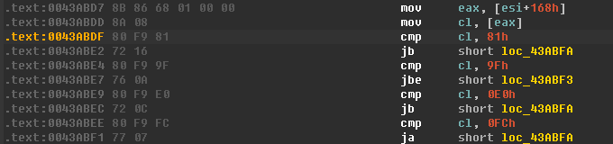

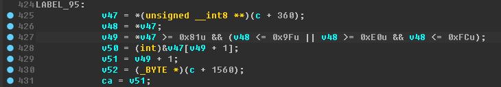

在主程序中搜到了4个地方。

这种字符边界检查只需要把`9F`改成`FE`就行了。可以直接修改主程序，或者像我这样动态修改也行。

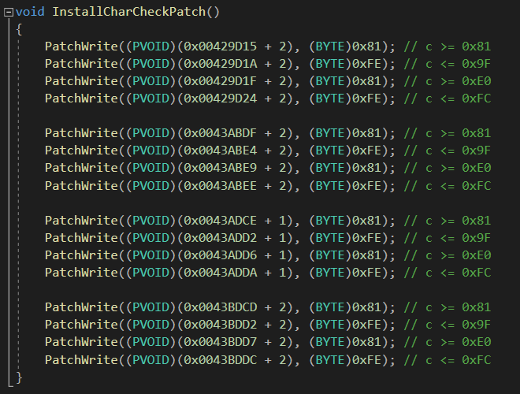

改完主程序的字符边界检查之后，将`shift-jis`编码的剧本文件转为`gbk`编码，使用前面提到的资源文件Hook将新的剧本文件替换进去。

测试后发现一部分文字可以正常显示，一部分还是乱码。这大概率是还有哪里的字符边界检查没有修改。然后又在主程序中搜索了各种字符串边界，都找不到，怀疑是在游戏脚本中进行的。

给剧本文件数据下内存访问断点进行跟踪，发现剧本文件的解析代码并不在主程序里，而是在游戏脚本里。游戏脚本会逐个字节读取剧本文件。

对游戏脚本读取剧本文件数据的OP下断点跟踪，找到当前正在执行的VM代码，发现VM代码在`start.scn`这个文件里，于是先把这个文件Dump出来。

对几个关键的OP进行分析之后，确定了游戏脚本中的字符边界检查。

```
[01F4] VM_Cmp_U
{
	00: [==]
	01: [!=]
	02: [>=]
	03: [>]
	04: [<=]
	05: [<]
}

F4 01 0C 01 00 02 04 81 00 00 00 E0 0B 00 00 
+---+ +------+ ++ +------------+ ^^^^^^^^^^^
// {F4,01} 比较数值
// {0C,01,00} 从内存中加载一个 dword
// {02} 大于等于
// {04,81,00,00,00} 加载一个 dword 立即数 0x00000081
// {E0,0B,00,00} 立即数 0x00000BE0 如果比较结果为 false 则跳转到这个地址执行代码


// if ( v1 >= 0x81 && v1 <= 0x9F )
F4 01 ?? ?? ?? 02 04 81 00 00 00 ?? ?? ?? ?? F4 01 ?? ?? ?? 04 04 9F 00 00 00 ?? ?? ?? ??

// if ( v1 >= 0xE0 && v1 <= 0xFC )
F4 01 ?? ?? ?? 02 04 E0 00 00 00 ?? ?? ?? ?? F4 01 ?? ?? ?? 04 04 FC 00 00 00 ?? ?? ?? ??


已找到 9 个 '04 9F 00 00 00'.		
BD2h	5h	04 9F 00 00 00
718Dh	5h	04 9F 00 00 00
92CAh	5h	04 9F 00 00 00
527B3h	5h	04 9F 00 00 00
529C7h	5h	04 9F 00 00 00
52BCCh	5h	04 9F 00 00 00
9609Ah	5h	04 9F 00 00 00
963E4h	5h	04 9F 00 00 00
96593h	5h	04 9F 00 00 00
```

可以看出边检检查的方式跟主程序是一样的，所以我们只要把`9F`改成`FE`即可。可以直接搜索` 04 9F 00 00 00`。

修改上述字符边界检查之后把`start.scn`替换掉，发现游戏中的文本已经不乱码了，但是文本的排版出了问题。

文本排版问题一般跟脚本中的一些标点符号有关，所以尝试在`start.scn`中搜索剧本里出现的一些标点符号的编码，例如`【】`、`「」`等。

尝试直接用通配符搜索`04 81 ? 00 00`，`04`是加载立即数的指令码。

去掉`81 00 00 00`和`81 40 00 00`这两个字符的结果之后，以下这些就是括号的字符。

```
已找到 24 个 '04 81 ? 00 00'.		
...
514B4h	5h	04 81 75 00 00	「
514D9h	5h	04 81 77 00 00	『
514FEh	5h	04 81 69 00 00	﹙
51632h	5h	04 81 71 00 00	〈
...
7E73Bh	5h	04 81 79 00 00	【
7E7E0h	5h	04 81 7A 00 00	】
...
95FFBh	5h	04 81 75 00 00	「
9601Ch	5h	04 81 77 00 00	『
9603Dh	5h	04 81 69 00 00	﹙
...
```

把这些字符的编码改成GBK编码之后，文本排版就正确了。实际上只改`【】`和`「」`的就行。

最后还有一个问题，那就是日文原版的上标文本`Ruby`不见了，按理说字符边界检查都应该改完了，游戏文本也没有乱码，可以正常解析。

于是把原版日文编码的Ruby文本复制到GBK编码的剧本文件里，发现可以正常显示字符，但是乱码（因为是`shift-jis`编码），这说明确实还有边界检查没改，而且用于Ruby文本的字符边界检查是单独写的。

经过几次尝试，发现Ruby只有注音字符可以显示，日文汉字也无法显示，于是在`start.scn`中搜索注音字符的编码。

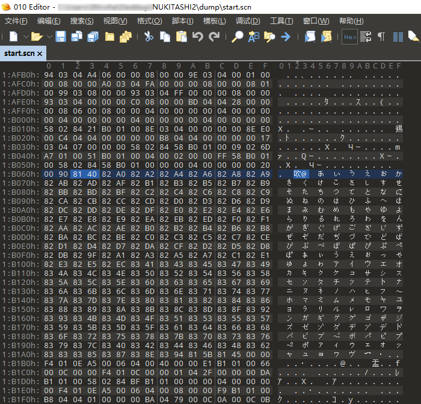

然后尝试把其中的一个字符编码修改为GBK编码，发现游戏可以正常显示该GBK字符。

很显然，中文字这么多，我们不可能改这个注音字符表。那就只能去修改字符检查的地方了。

启动游戏，挂上调试器，在内存中搜索这个注音字符表，然后设置内存访问断点。

游戏中走到有上标文本的台词文本时，程序中断了下来。仔细观察后发现，访问这个表的代码根本不在主程序里的代码段，而是另外一块内存。

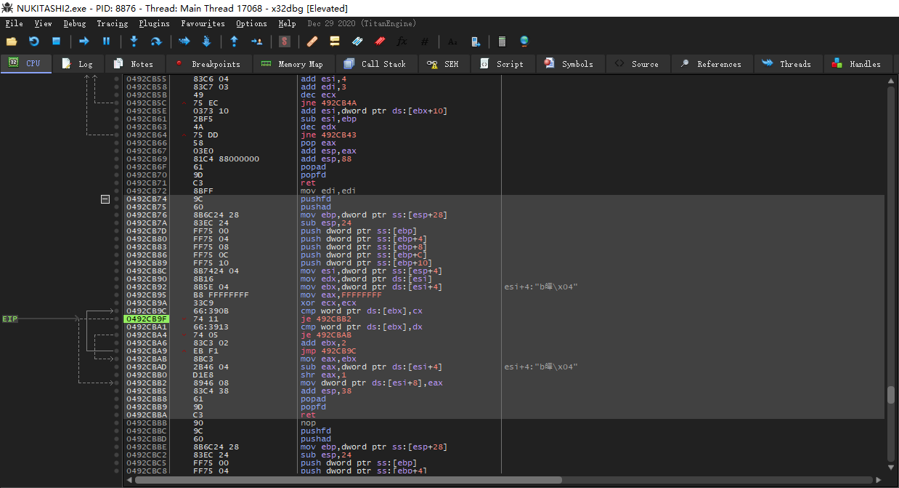

先不管它是哪里的代码，执行这个函数的代码肯定是，游戏脚本中的某个OP，所以`Ctrl+F9`跟踪。

然后发现是`sub_4236E0`调用这个函数的，而`sub_4236E0`外面就是VM的switch，所以它就是一个游戏脚本的OP。

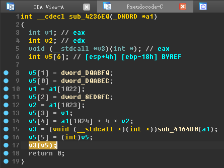

我们可以顺藤摸瓜找到VM当前正在执行哪里的代码。`a1`这个参数就是VM对象的指针。

先`Ctrl+F9`从这个函数出来。

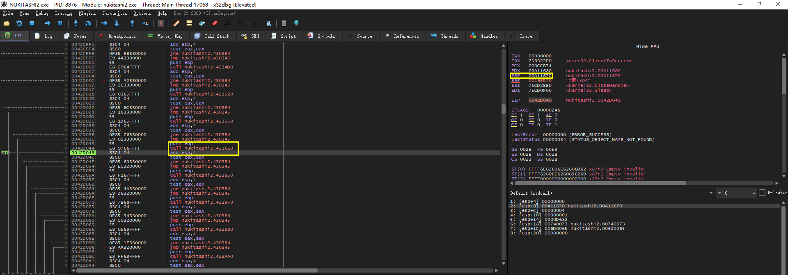

这时被Push到栈里的`EBP`已经恢复，所以当前`EBP`的值就是VM对象的指针。

VM对象中0x10偏移处的`dword`就是当前VM正在执行的游戏脚本代码，这个偏移值在`sub_4297D0`函数的头部就可以发现。

然后在内存窗口中按`Ctrl+G`输入表达式`[ebp+10]`即可转到当前正在执行的游戏脚本代码。

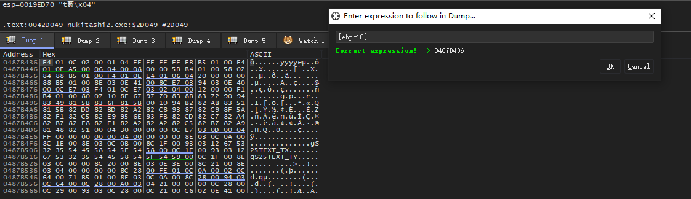

我们可以看到一个眼熟的Opcode，`F4 01`比较数值。

如果刚才执行的函数是检查要渲染的字符是否在注音字符表里，那么这里的数值比较很有可能就是检查刚才那个函数的返回值。

反编译这一行脚本代码。

```
76 02 84 74 CB 0C 00 F4 01 0C 02 00 01 04 FF FF FF FF EB B5 01 00
+---+ +------------+ +---+ +------+ ++ +------------+ ^^^^^^^^^^^
// {76,02} 调用 sub_4236E0 这个OP，这个OP的作用是：调用指定地址的函数。
// {84,74,CB,0C,00} 读取一个整数 0x000CCB74 是要调用的函数地址。也就是刚才那个不在主程序代码段里的函数。
// {F4,01} 比较数值
// {0C,02,00} 从内存中加载一个数值，前面调用的函数的返回值。
// {01} 不等于
// {04,FF,FF,FF,FF} 加载一个立即数 0xFFFFFFFF 也就是 -1
// {EB,B5,01,00} 如果判断条件为false就跳转到这个地址去执行代码。

// $ret = wstrstr()
// if ($ret != -1 )
//   显示
// else
//   跳过
```

我们顺便看一眼那个奇怪的函数长什么样。

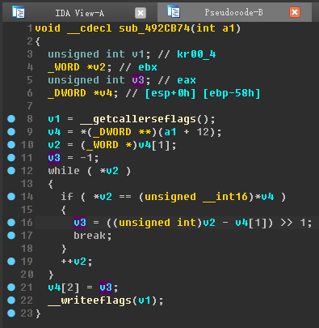

可以看到它确实在循环查找，每个元素都是2字节（`int16`）。

这里的`v3`就是`result`，如果没有找到，它的值就是`-1`，跟上面的游戏脚本代码对得上。

于是我们只要让那个数值判断失败之后也跳转到成功的地方去执行代码就行了。

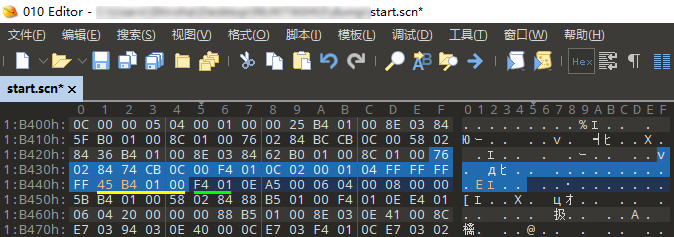

上图中，黄线部分是一个地址，如果比较失败，VM则会跳转到该地址去执行代码。绿线部分是比较成功后会执行的代码。

我们把跳转地址改成绿线部分的地址就行了。

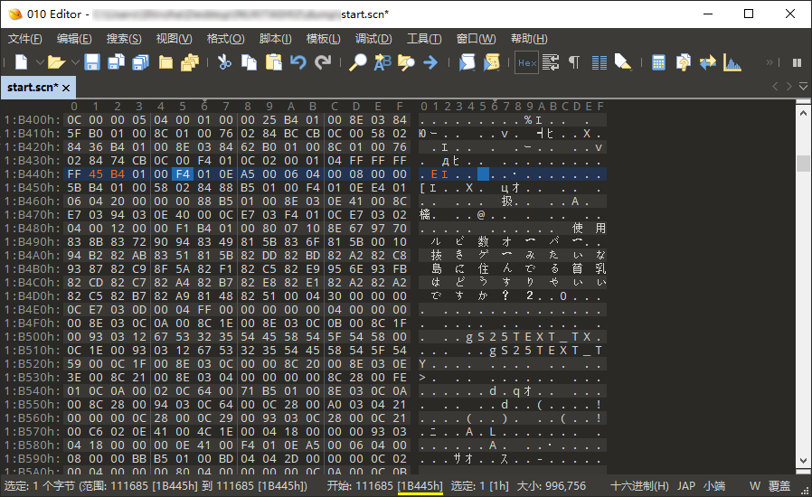

地址其实就是相对于整个文件的偏移量，编辑器会显示出来。

改完之后发现上标文本`Ruby`可以正常显示了。

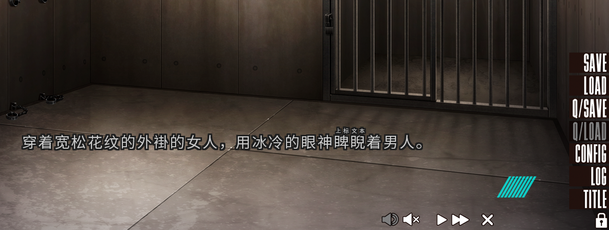

## 六、字体

改字体的方式有两种，一种是直接在`start.scn`里搜索`fontName`和`charset`来修改，另一种是通过Hook`CreateFontA`来实现。