---

---

# シュヴァルツェスマーケン 紅血の紋章

## 一、ICI文件

引擎信息：

```
The relic Unified Game Platform (rUGP) engine. An engine that makes miracles possible, and powers all things age.
```

资源封包文件：

```
schewaA.rio
schewaA.rio.002
schewaA.rio.ici
```

游戏的主要资源文件就是这几个了，其中`rio`和`rio.002`根据文件名可推测是分卷形式，仍需进一步分析。

经过简单的`CreateFile`断点之后，发现`rugp.exe`先读取了`ici`文件，所以先对`ici`文件进行分析。

简单跟踪后，发现主要的代码都在`UnivUI.dll`里，加载了`mfc120`等符号之后，可以发现文件读写使用了`MFC`的`CFile`类。

继续跟踪之后发现引擎给`CFile`包装了一层，类名是`CSizedFile`。

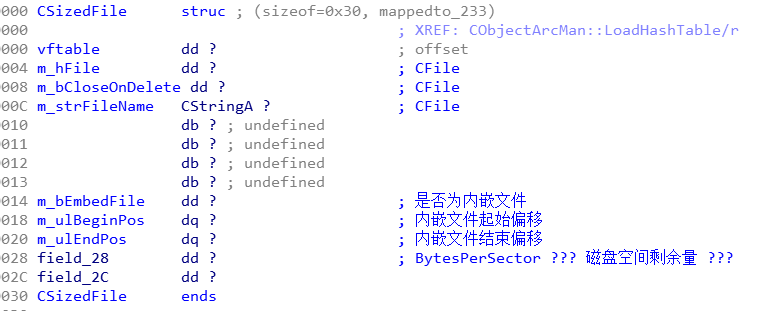

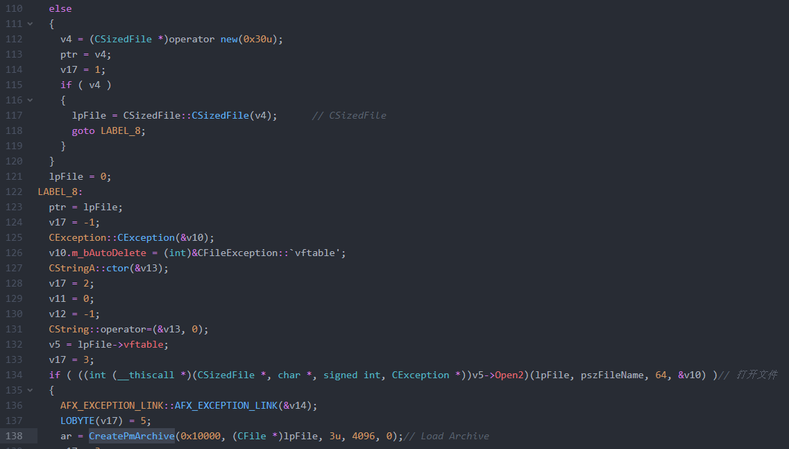

先创建了一个`CSizedFile`然后调用虚函数`Open`实际打开了文件。
如果打开成功，会进入`CreatePmArchive`这个函数。
这个函数是一个工具函数，用于创建`CPmArchive`对象。
上面代码简化之后就是这样：

```c++
CFile* pFile = new CSizedFile();
pFile->Open( pszFileName );
ar = CreatePmArchive( pFile );
return ar;
```

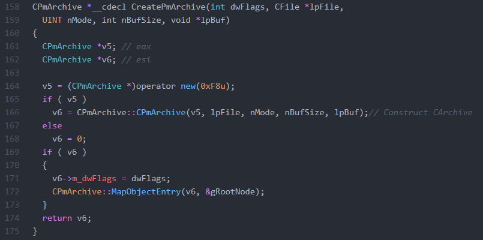

进入`CPmArchive`的构造函数之后发现`CPmArchive`里有一个`CArchive`对象。

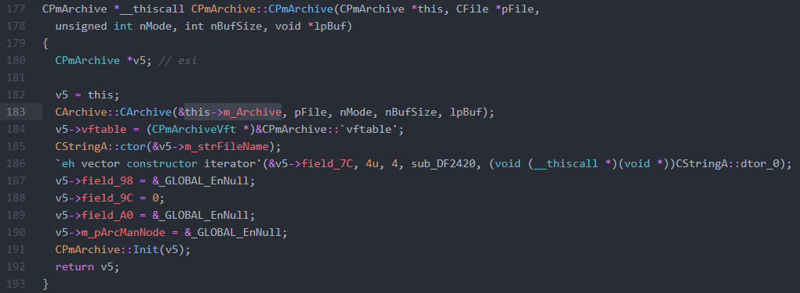

这个`CArchive`是`MFC`的东西，所以需要查看`MFC`的源码。网上以及`MSDN`都有详细介绍。
简单说`CArchive`就是`MFC`为了方便APP存储和载入文档而造的一个轮子，相当于一个文件读写工具。
说高端点就是对象の序列化と反序列化。
从这个函数出来，`CArchive`/`CPmArchive`对象已经构造完整，并且可以开始读写文件了。
接着跟踪几步之后，就会到`LoadForChild`这个函数，当然名字是我随便写的。

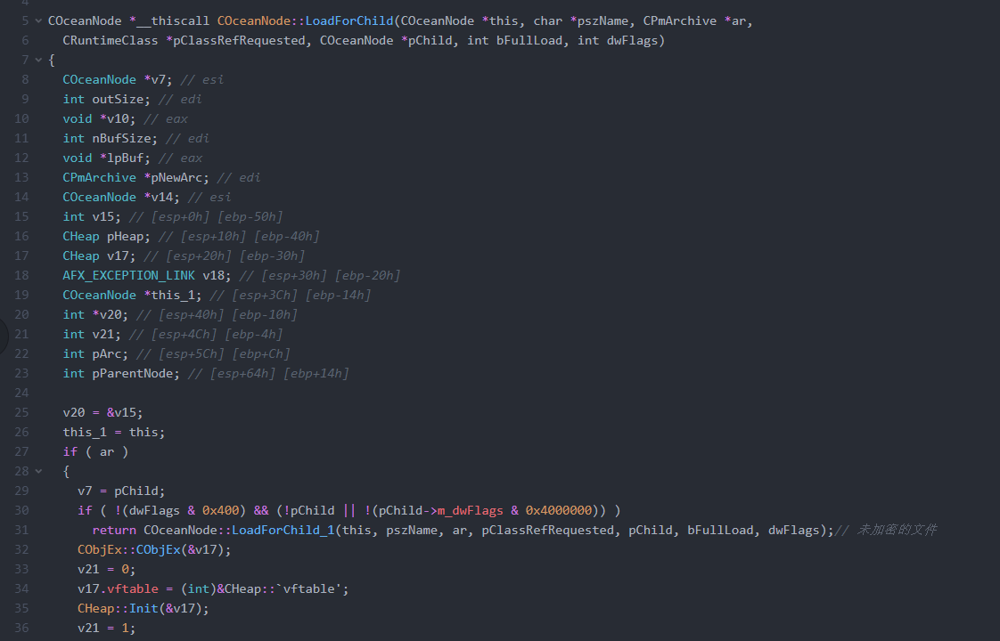

由于`Ici`文件是个加密文件，所以并不走这个分支，而是接着往下走。

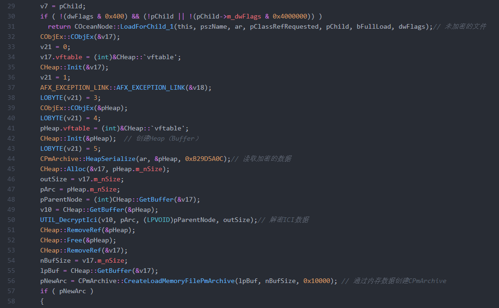

先通过`CPmArchive::HeapSerialize`从文件中读取并解密数据。加密数据中包含了`Heap`的大小，所以不需要读取时指定。
把数据读取到`Heap`之后，还要经过一次解密`UTIL_DecryptIci`，才能得到明文的`Ici`数据。

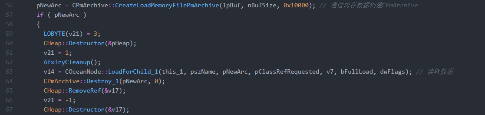

得到明文数据之后，就开始进行读取载入了。

## 二、OceanNode

看到上面的代码之后，估计应该都很想知道这个`COceanNode`是什么东西吧。
这个`OceanNode`贯穿整个`rUGP`引擎，是这个引擎的`Framework`。
这个`Node`其实就是一棵树，就是数据结构里的那种树。
`OceanNode`把整个`rUGP`引擎里所有的对象以及资源组织成了一棵树。
如果有学过`U3D`或者一些现代游戏引擎，应该对这个概念比较熟悉。

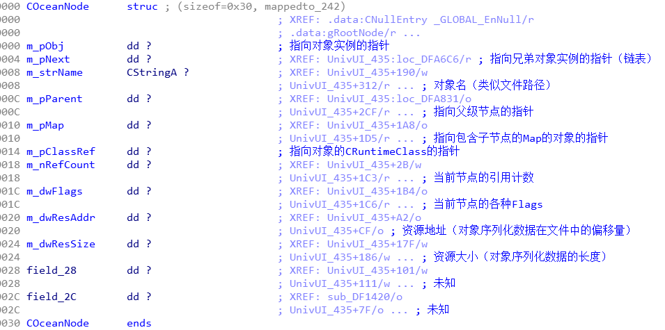

可以看出这是一个典型的树形结构，指向父级的指针，包含子级的容器。
先一个个来。
上面说到，`OceanNode`用于组织引擎中的各种对象，所以每个`OceanNode`当然有一个指向对象实例的指针。
即：`m_pObj`
然后就是用于存储子节点的容器：`m_pMap`
它指向一个`CNodeMap`对象，定义如下：


这是一个`HashMap`的简单实现。
它通过计算节点的名称（即`m_strName`）的Hash值来确定要把节点指针放在哪个桶里。
由于`Hash`值可能会冲突，所以每个桶里的节点指针通过链表形式来存储该桶里的其它节点，这就是`m_pNext`的作用。
光是文字可能不够形象，所以我弄张简单的结构图。


整个引擎绝大多数对象都会通过`OceanNode`组织起来。
（包括所有的游戏素材（这个才是重点吧（划掉）））
每个节点（的对象）还可以接收消息做出相应动作，这个后面再说。

## 三、序列化和反序列化

即：把内存中的对象实例存储到文件中、从文件中读取数据并重新构建对象实例，的过程。
该引擎通过`MFC`的`CArchvie`来实现该过程，所以当然要学习`CArchvie`的用法才行，而`CArchvie`、`CObject`、`CRuntimeClass`是`MFC`的关键三要素，所以必须简单地学习一下`MFC`才行。
当然网上有各种资料，而且`MFC`也是开源的，这里我并不想过多赘述，我只做简单的说明。
每个需要序列化/反序列化的对象都必须继承`CObject`，因为这样才有相关的功能函数来实现它。
`CObject`有一个虚函数：`Serialize` 只要实现这个函数，对象就可以支持序列化。
想把一个对象存储到文件中时，只需要简单调用：`ar << obj;` 即可，其内部会调用`Serialize`来实现具体的数据读写。
对象的序列化当然还涉及反射，也就是`CRuntimeClass`，当需要从文件中读取一个对象时，会先读取该对象是什么类，然后创建该类的实例，最后调用`Serialize`从文件中读取该对象的数据，完成反序列化。

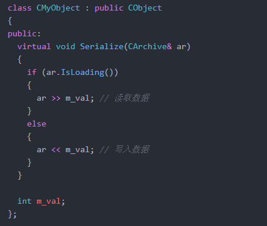

以上是简单例子，详细的关于`MFC`的对象序列化可以在网上搜索到相关资料。

## 四、OceanNode的序列化

初步了解序列化相关知识之后，现在进入`LoadForChild_1`这个函数。

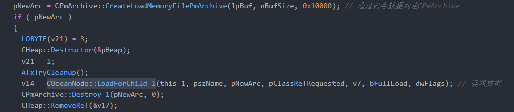

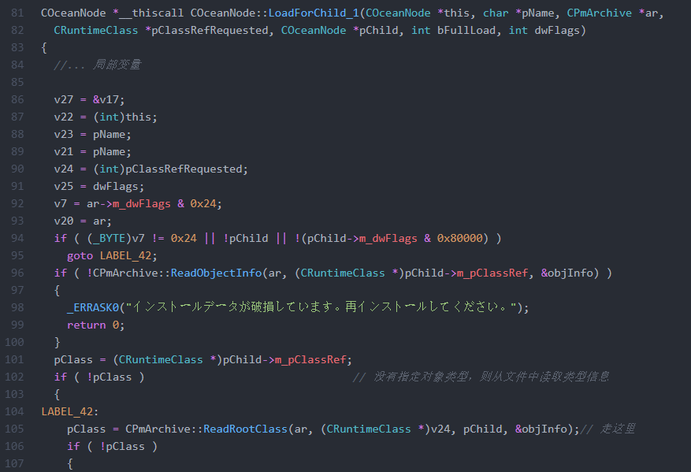

先解释一个关键的参数`pChild`。
如果传进来`NULL`，将会创建一个新的子节点，然后从文件中载入该子节点的数据。

函数进来之后，通常会先走`CPmArchive::ReadRootClass`来读取第一层信息。

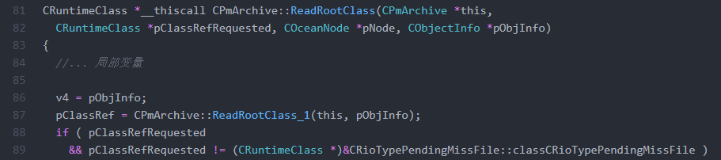

里面还套了一层，继续跟进。

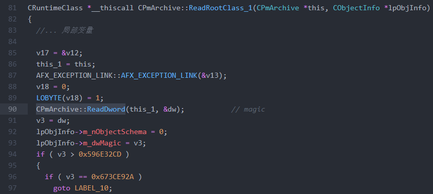

首先读取了一个`DWORD`（即4字节整数）作为`MagicNumber`，判断类型。

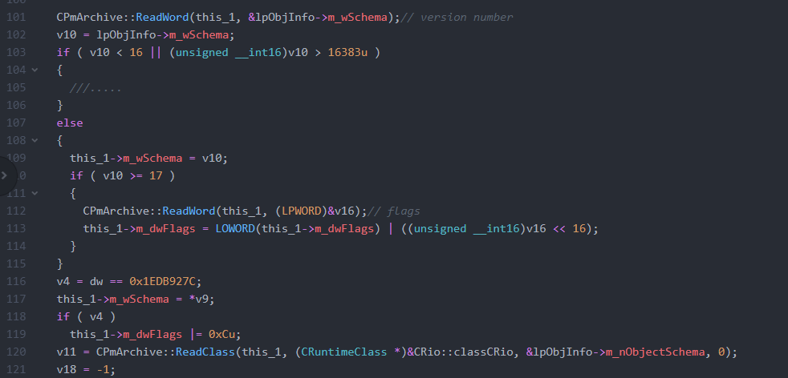

往下读取了`版本号`和`Flags`，接着就会进入`CPmArchive::ReadClass`。

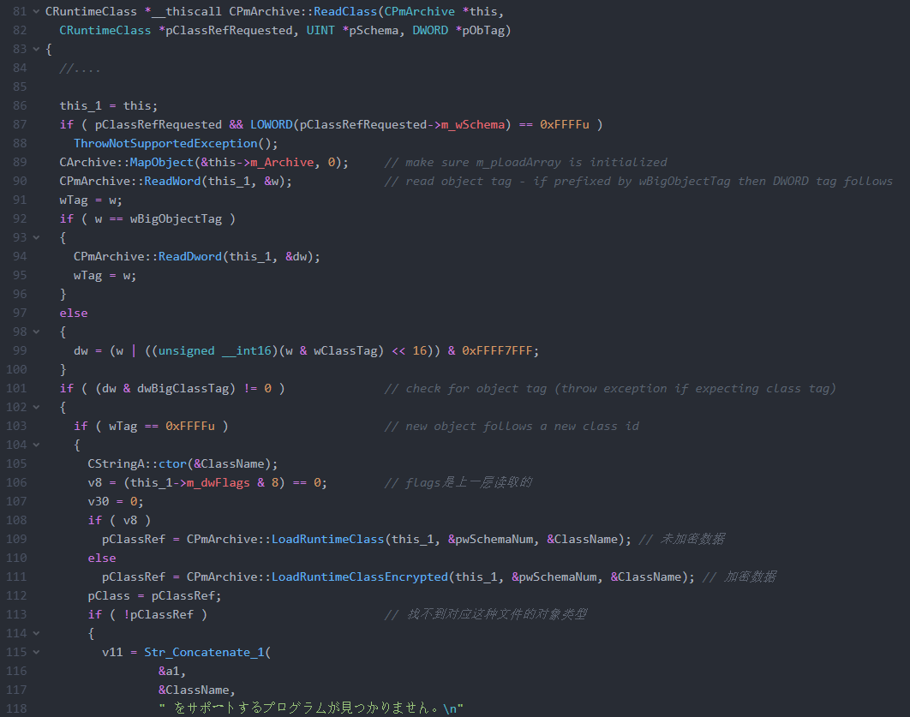

这个函数基本就是照抄`CArchive`，增加了一个读取加密`RuntimeClass`的功能。
该函数从文件中读取一个类名（字符串），例如`CObjectOcean`，然后从程序中查找该类是否存在，如果存在则返回相应的`CRuntimeClass`指针。
然而实际上这里是`CRioRTC`指针，该类继承了`MFC`原版的`CRuntimeClass`，增加了一些数据。这里不多解释，后面才有用。
下文`RuntimeClass`简称`RTC`。
读完`RTC`之后就返回到`COceanNode::LoadForChild_1`了。

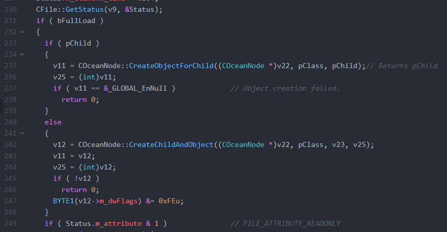

先是创建相应的子节点和该子节点管理的对象`Object`。

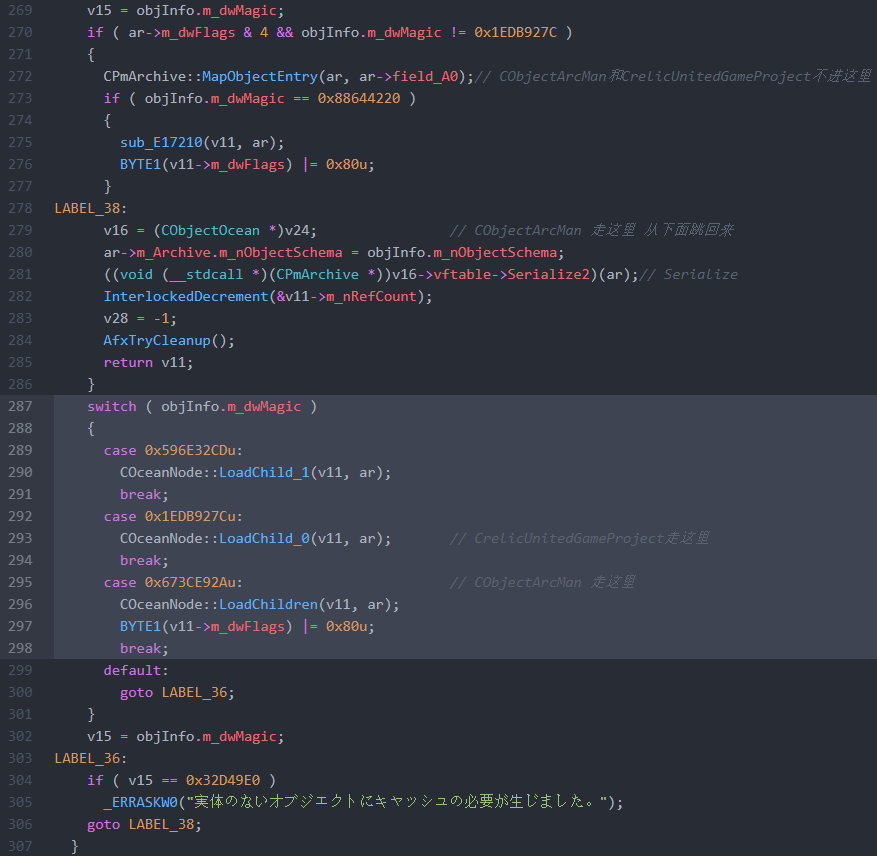

然后会走到这个`switch`，`COceanNode::LoadChildren`如其名，即是载入该节点的子节点。
这里暂且略过。
载入完子节点之后，会回到`LABEL_38`。这里调用了该节点所管理的对象的序列化函数，即从文件中读取数据并重新构建该对象。

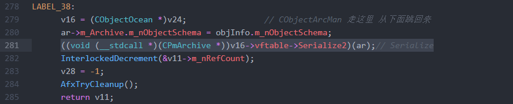

至此一个`OceanNode`就载入完成了。
下面再看看`COceanNode::LoadChildren`。

## 五、OceanNode子节点的加载

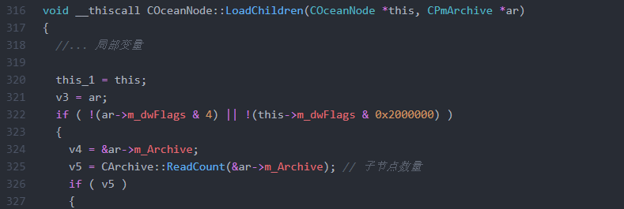

`COceanNode::LoadChildren`先从文件中读取了一个整数，即该节点下的子节点的数量。

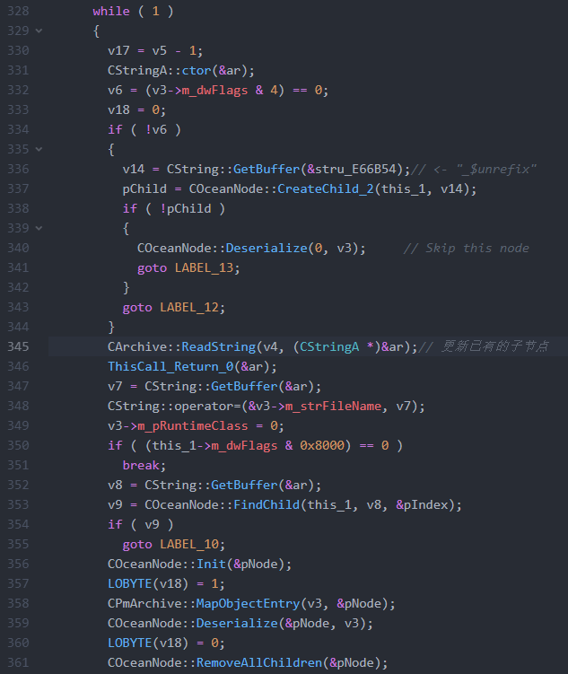

然后计次循环，读取所有子节点。
根据相关`Flag`判断应该创建子节点还是通过名称来查找现有的子节点进行更新。
创建好子节点后，就会调用`COceanNode::Deserialize`或者`COceanNode::Serialize`来执行该子节点的反序列化过程。
这两个函数实现差不多，只不过用途不同。

进入`COceanNode::Serialize`函数。

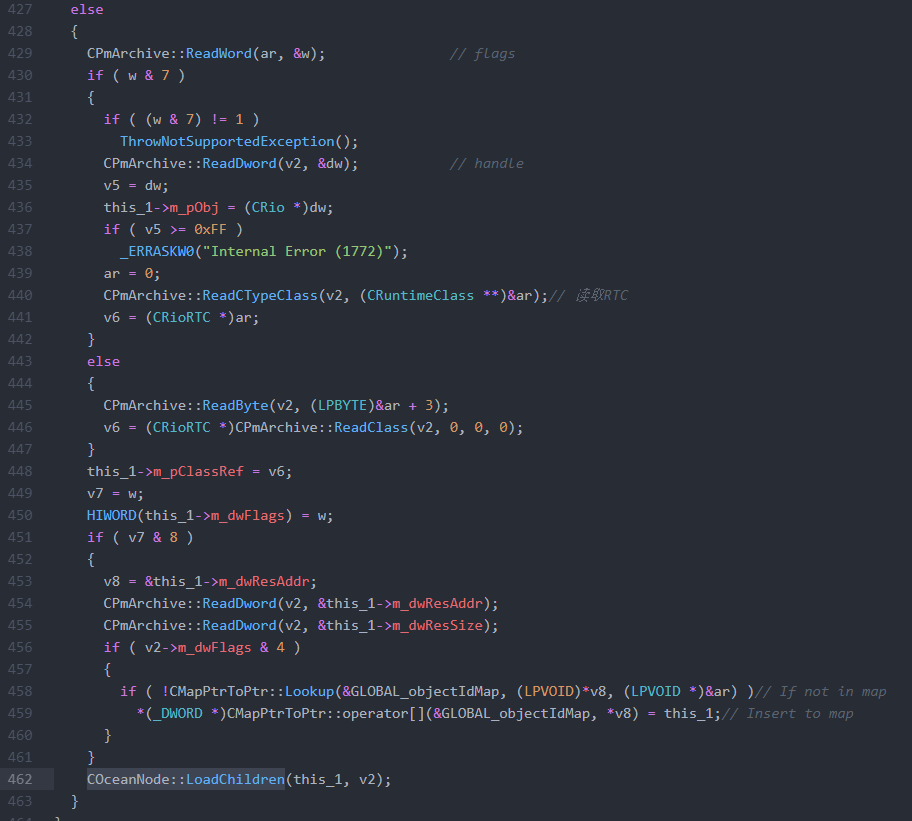

首先是读取`Flag`以及`ReadCTypeClass`。
其中`ReadCTypeClass`还细分为：

```
CPmArchive::ReadClass
CPmArchive::ReadMsgClass
CPmArchive::ReadBasicTypeClass
```

总之就是返回一个`RTC`指针。

接着读取了两个了`DWORD`，分别是该节点管理的对象的序列化数据在文件中的偏移量和大小。
然后把该节点加入全局的`OceanNode Map`中，而`Key`即是偏移量。
该`Map`在引擎中起到至关重要的作用，后面所有需要引用某一个子节点的时候都通过`Key`来直接查找相应的节点。

以上即完成了该节点的读取，但还没完。因为该节点也可以有子节点。
所以递归执行`COceanNode::LoadChildren`。

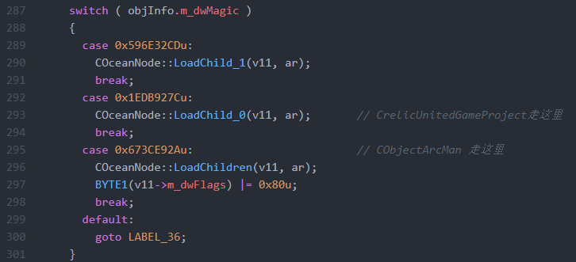

递归完成出来回到这里之后，该节点的所有子节点就读取完成了。

你可能注意到上面的代码只读取了节点的少数数据，例如`RTC`（即`m_pClassRef`）以及`Addr`、`Size`
是的，`COceanNode::LoadChildren`只载入了这些，并不会同时加载每个子节点所管理的对象。

## 六、对象的加载

即`OceanNode`所管理的对象（`m_pObj`）
想要加载该对象，则需要知道该对象的序列化数据存在哪里。
该数据即是`OceanNode`的：
`m_dwResAddr`和`m_dwResSize`
这两个数值是加密的，需要经过简单的解密运算才能得到真正的数值。

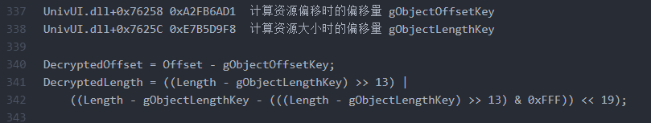

至于为什么叫`Addr`呢，这跟`rio`文件的分卷有关，我第一时间联想到的是地址空间的概念，所以就随意起了这个名字，反正它就是个`offset`。
注意：实际上`DecryptedOffset`还需要经过一次运算才能得到真正的偏移量，后面会说到。

`rio`文件分卷：
引擎把所有`rio`文件分卷连接成一个地址空间
假设`分卷①`文件的大小是`2GB`，则该分卷的地址空间就是 `0~2147483648`字节。
`分卷②`的地址空间则从`2147483649`字节开始，以此类推。
`OceanNode`中存储的`ResAddr`的值范围一定会落在所有分卷拼成的完整地址空间中。
所以读取数据时，还要根据`Addr`来区分数据具体在哪一个分卷里。确定了分卷之后，就要通过减法来计算真正的文件偏移了。
有了以上基础，就能从所有分卷中读取指定`Addr`处的对象数据。
当然引擎肯定有一个函数用来加载对象，即这个：

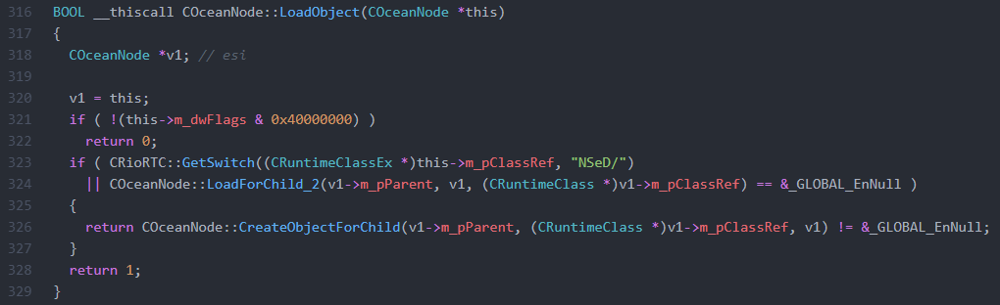

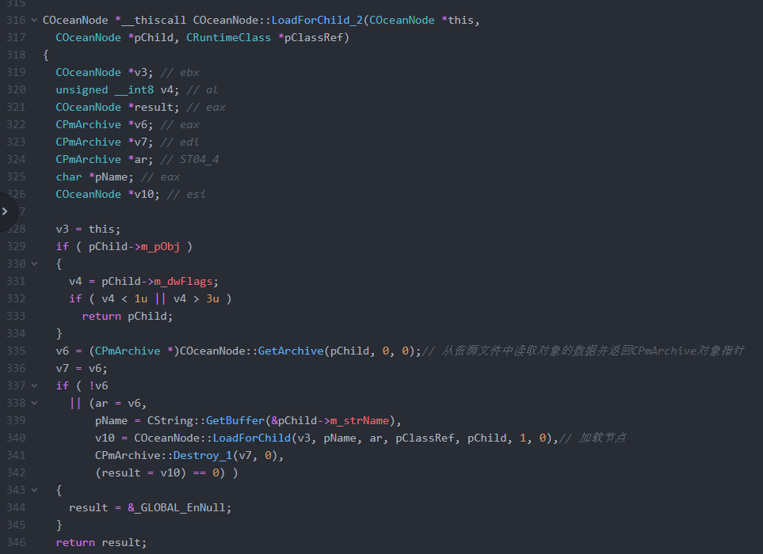

介绍完对象的加载之后，终于可以回到`ici`加载了。

## 七、CObjectArcMan

实际上`ici`文件里的数据就是`CObjectArcMan`对象的数据。
通过加载`ici`文件，可以构建出一个`CObjectArcMan`对象，该对象包含了非常重要的信息。
首先它存储了游戏的基本信息，以及安装信息，这些数据会在安装游戏时用到。
它包含每个`rio`分卷文件的信息，通过一个`CInstallSource`对象数组来存储。
`CInstallSource`存储了一个分卷文件的所有信息，例如：该分卷的名称、地址空间范围、校检信息等等。
除了`rio`分卷信息，`CObjectArcMan`中还包含了游戏的入口点：`CrelicUnitedGameProject`对象的`Addr`。
游戏中所有的东西都包含在`CrelicUnitedGameProject`这个对象中。

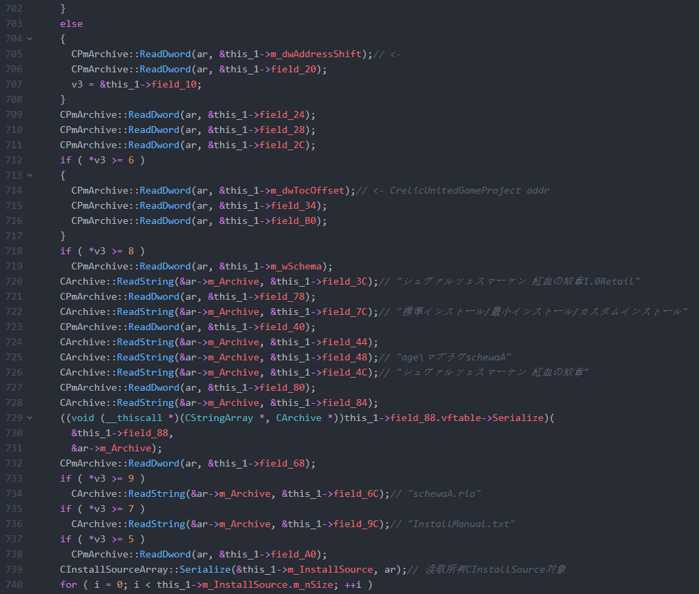

只有读取了`CObjectArcMan`后，才能知道怎么读取`rio`分卷文件。

## 八、CrelicUnitedGameProject
这个对象是游戏里的顶级对象了，如其名，它组织了一个游戏中所有需要用到的素材。
当然，就如前面所说，所有的对象都由`OceanNode`进行组织管理。
为了方便理解层级关系，我做一个简单的图。

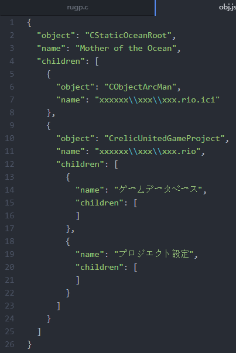

`CStaticOceanRoot`就是整个引擎中`OceanNode`的根节点。
它的子节点里有：
通过`COceanNode::LoadForChild`来加载的`CObjectArcMan`节点。
以及依然是通过`COceanNode::LoadForChild`来加载的`CrelicUnitedGameProject`节点。
当然还有其它的节点，不是很重要所以忽略掉。

## 九、素材
想要提取那当然是要遍历`CrelicUnitedGameProject`节点的所有子节点，找到想要的东西。
但不知道从哪个版本开始，`rUGP`把素材“藏起来”了，也就是说，仅通过`LoadForChild`载入`CrelicUnitedGameProject`是无法找到想要的东西的，那还有什么办法吗？
当然有，想要在游戏里显示一张CG那肯定是有相应的指令的。
而这些指令存储在`rUGP`的脚本对象`CRsa`里。
而这些`CRsa`是可以直接遍历`CrelicUnitedGameProject`找到的。
所以只要加载每一个`CRsa`对象，并分析其中的指令，就能得到几乎所有素材的信息，拿到`Key`（即`offset`）之后就可以去找分卷文件来读取素材对象了。

## 十、CRsa
通过`ResAddr`和`ResSize`读到`CRsa`对象的序列化数据之后，就可以进行反序列化了。
如图：
`CRsa::Serialize`函数

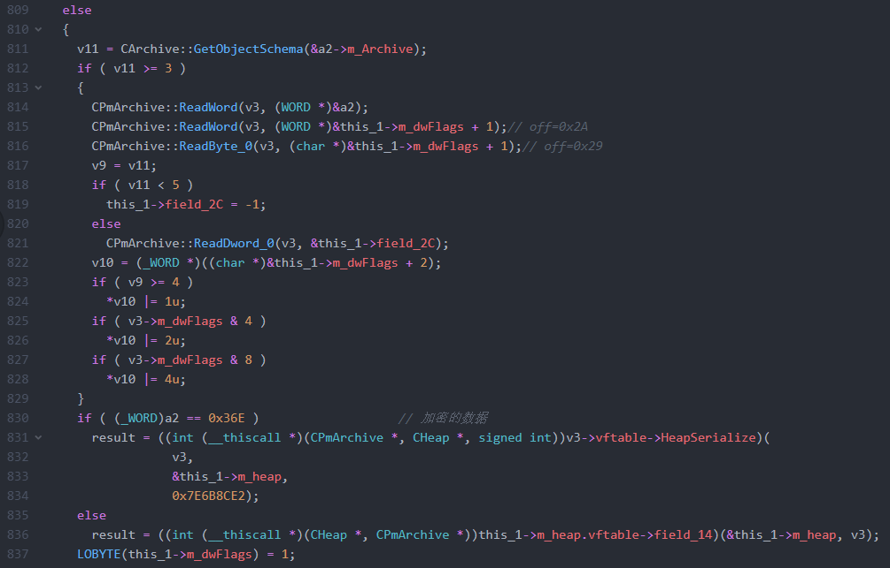

前面有几个整数信息，其中一个加密标记，如果有加密，则需要调用`CPmArchive::HeapSerialize`来读取并解密。
`HeapSerialize`就是上面读`ici`用到的那个，只不过key换了。

很显然`CRsa::Serialize`只是把一堆数据读进内存，并没有做更多解析。所以还需要找其它函数。
往上一翻就找到了`CRsa::ExtractData`这个函数。
它负责解析刚才读到`Heap`里的一堆数据。

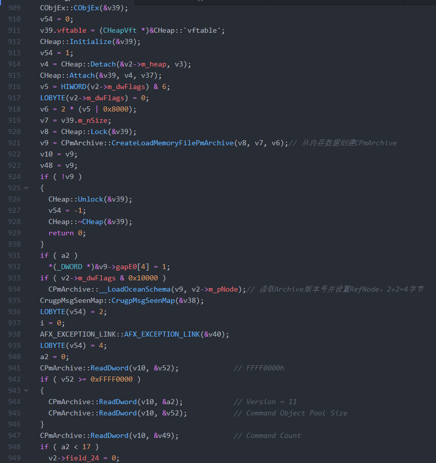

前面是几个整数，包含了版本号，命令对象池的大小（字节），命令数量，等等。

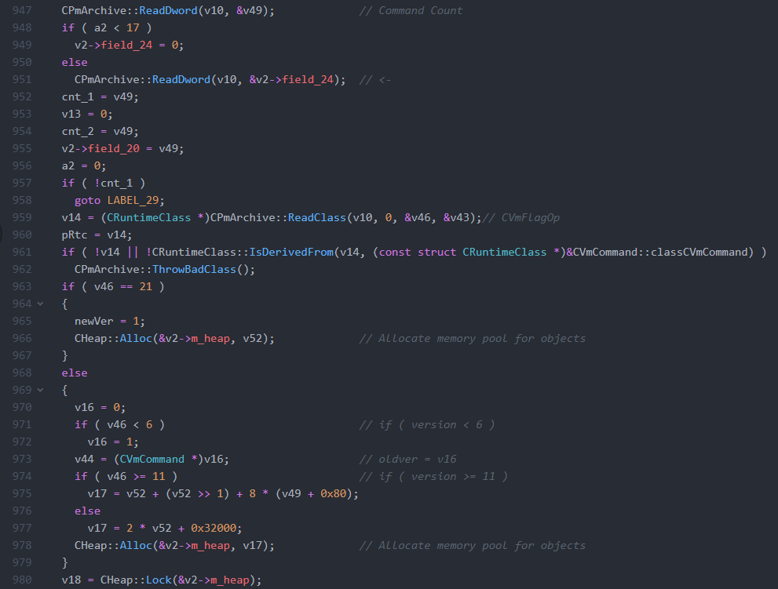

分配命令对象池的内存。

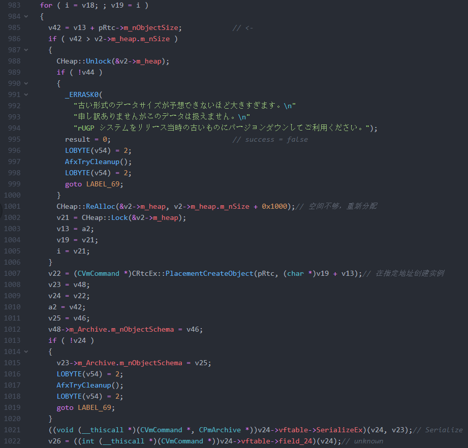

循环读取并创建所有命令对象实例。

可以看出来，一个`CRsa`对象其实就是一堆命令`CVmCommand`的集合。
并且它们是按顺序排列的，这是为了方便存档和读档。
存档时只需要存储当前执行到了哪一条命令即可。（大概吧（不是））

在`CRsa`中，基本的命令有这些：

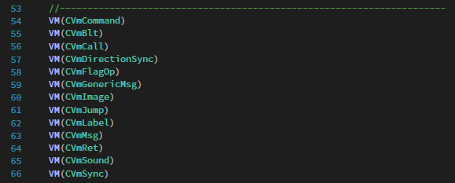

其中有些命令通过名称就可以大概猜测其功能。
例如：
`CVmCall`调用其它命令或`CRsa`脚本
`CVmFlag`对Flag进行操作（例如设置某条文本是否已读）
`CVmGenericMsg`执行引擎基本命令，其中包括几十种不同的命令，大多数名字以`OM_`开头，可以调用引擎中各种功能。
`CVmImage`还没有进行分析，猜测用于加载或显示图片。
`CVmJump`跳转到指定的`CVmLabel`处执行
`CVmLabel`用作定位标记
`CVmMsg`用于显示游戏中人物对话的文本
`CVmRet`结束`CRsa`脚本，使脚本执行完毕
`CVmSound`播放声音
`CVmSync`未知

十一、提取游戏文本
简单说就是，分析`CVmMsg::Serialize`即可。

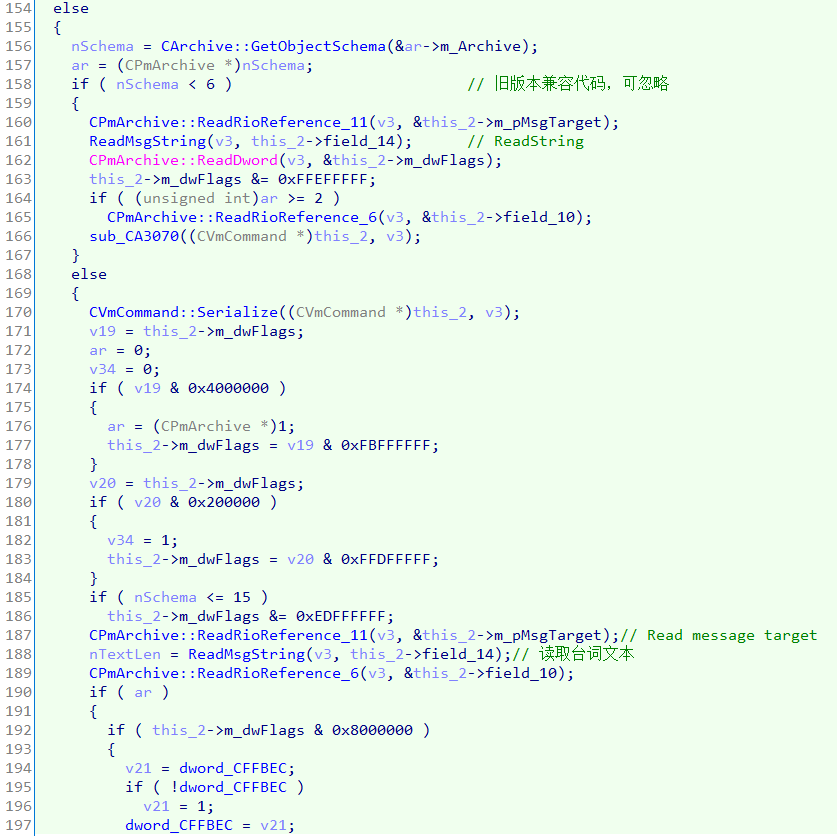

打了个简单的`log`可以看看：

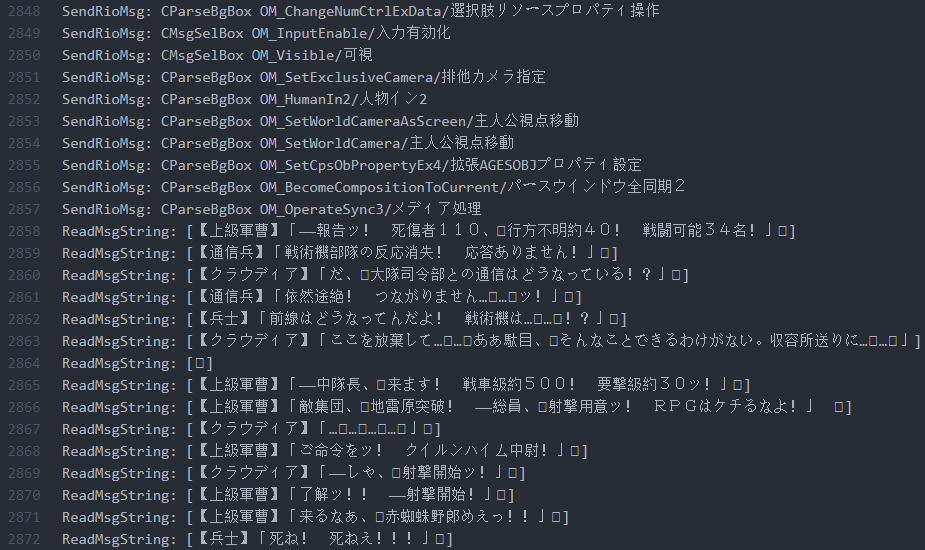

实际上`CVmMsg`应该还有其它用途，不仅仅是显示对话文本。

## 十二、CVmGenericMsg
这个命令用于发送一个`CRioMsg`给指定的`OceanNode`。

消息类型定义如下：

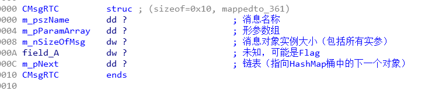

消息参数定义。

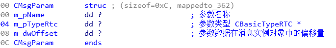

`m_pParamArray`会指向一个静态数组，其中包含多个`CMsgParam`。


上面有提到，`COceanNode`里的`m_pClassRef`指向`CRioRTC`对象实例。
所以这里给一下定义：

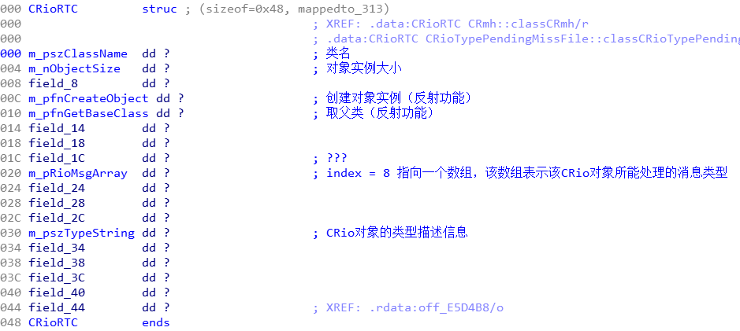

上面似乎忘了提到`CRio`这个东西。
引擎中几乎所有能存储到文件中的对象都继承于`CRio`。
比方说`CrelicUnitedGameProject`的继承关系是这样的：

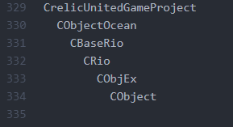

最底层还是`MFC`的`CObject`
回到本题。当想要给引擎中某一个`OceanNode`发送一个消息时，首先要创建一个该消息的实例。
简单来说就是这样：

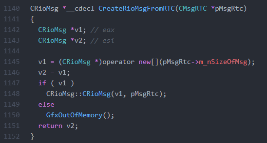

然后调用：

```
SendRioMsg
COceanNode::SendRioMsgNoArgs
COceanNode::SendRioMsgToAllChildren
```

或者其它未知的函数就可以把一个`RioMsg`发送给指定的`OceanNode`。

`SendRioMsg`首先会根据目标`OceanNode`的`m_pClassRef（CRioRTC）`来找到`m_pRioMsgArray`，即`Msg Handler Array`，如果在该数组中找到了能于`MsgRtc`匹配的`Handler`，就调用该`Handler`，处理该`Msg`。
如果找不到对应的`Hander`，则`SendRioMsg`什么也不干。

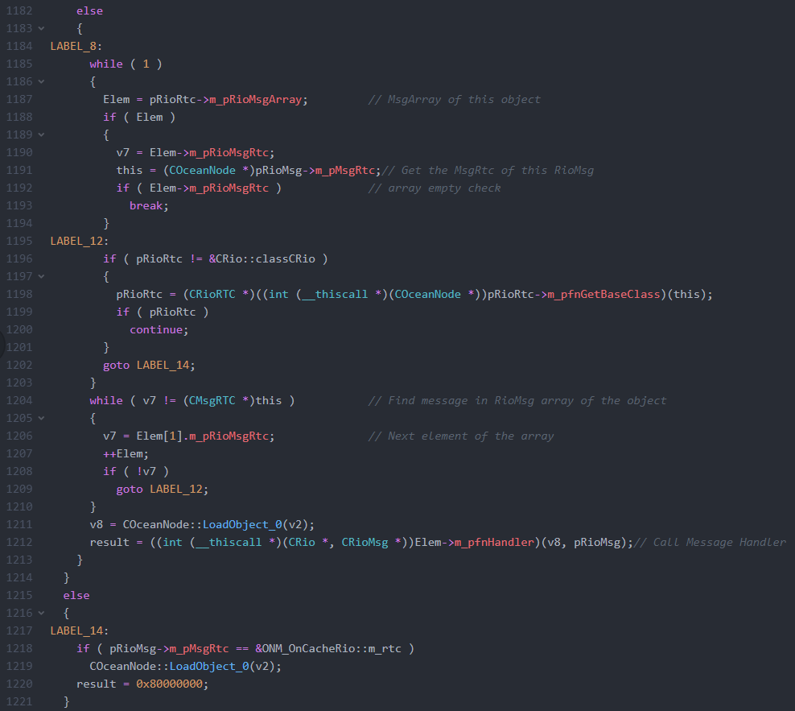

引擎各种动作都依赖`RioMsg`，例如：

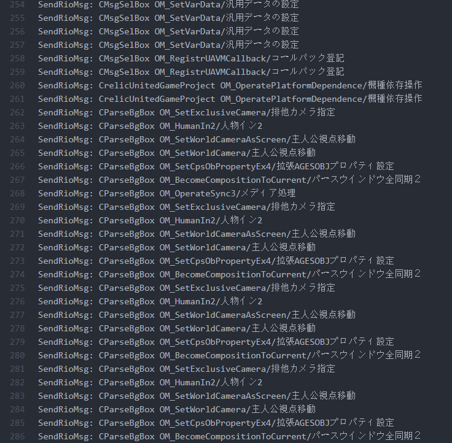